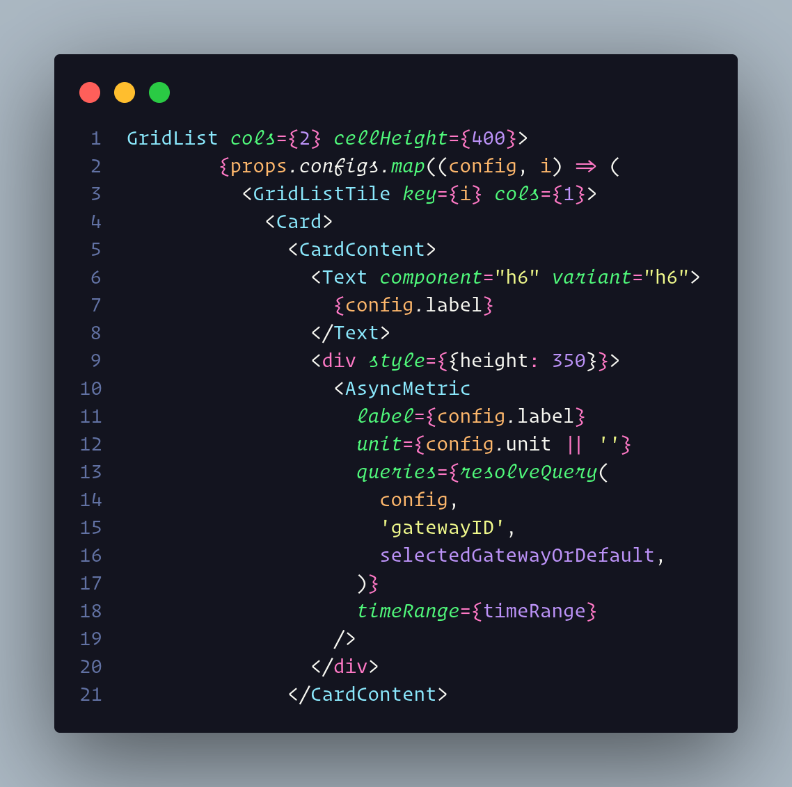

# Fonts Ligature fo VsCode

To configure Vs code with this font follow the steps bellow:



- Copy folder `.fonts` to `~/.fonts`
- Change `settings.json` on vscode:
  ```
  "editor.fontFamily": "'Operator Mono Lig', 'Fira Code'",
  "editor.fontWeight": "400",
  "editor.fontLigatures": true,
  ```
